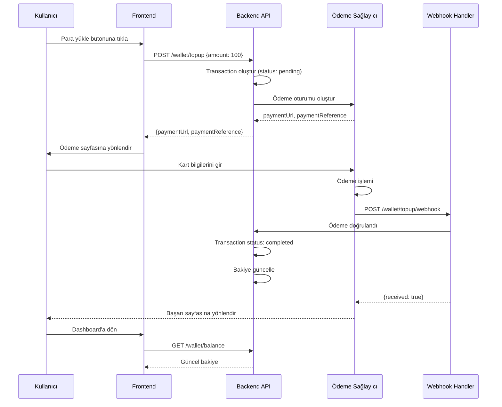

# Payment Integration Guide

Akıllı Kampüs Sistemi Ödeme Entegrasyonu Rehberi

---

## 📋 İçindekiler

1. [Genel Bakış](#genel-bakış)
2. [Ödeme Akışı](#ödeme-akışı)
3. [Stripe Kurulumu](#stripe-kurulumu)
4. [PayTR Kurulumu](#paytr-kurulumu)
5. [Webhook Implementation](#webhook-implementation)
6. [Test Kartları](#test-kartları)
7. [Güvenlik](#güvenlik)

---

## Genel Bakış

Akıllı Kampüs Sistemi, cüzdan (wallet) tabanlı bir ödeme sistemi kullanır. Kullanıcılar önce cüzdanlarına para yükler, sonra bu bakiye ile yemek ödemesi yaparlar.

### Desteklenen İşlemler:
- **Bakiye Yükleme (Top-up):** 50-5000 TRY arası
- **Yemek Ödemesi:** Cüzdandan otomatik kesim
- **İade:** İptal edilen rezervasyonlarda otomatik iade

---

## Ödeme Akışı



### Akış Adımları:

| Adım | Açıklama |
|------|----------|
| 1 | Kullanıcı tutar girer ve yükle butonuna tıklar |
| 2 | Backend pending transaction oluşturur |
| 3 | Ödeme sağlayıcısı oturumu oluşturulur |
| 4 | Kullanıcı ödeme sayfasına yönlendirilir |
| 5 | Kullanıcı kart bilgilerini girer |
| 6 | Ödeme sağlayıcısı webhook ile bildirir |
| 7 | Backend bakiyeyi günceller |
| 8 | Kullanıcı başarı mesajı görür |

---

## Stripe Kurulumu

### 1. Stripe Hesabı Oluştur

1. [Stripe Dashboard](https://dashboard.stripe.com/) adresine git
2. Hesap oluştur veya giriş yap
3. **Test Mode** aktif olduğundan emin ol

### 2. API Anahtarlarını Al

Dashboard > Developers > API Keys:
- **Publishable Key:** `pk_test_xxx` (Frontend için)
- **Secret Key:** `sk_test_xxx` (Backend için)

### 3. Webhook Endpoint Oluştur

Dashboard > Developers > Webhooks:

```
Endpoint URL: https://yourdomain.com/api/v1/wallet/topup/webhook
Events: 
  - checkout.session.completed
  - payment_intent.succeeded
  - payment_intent.payment_failed
```

### 4. Backend Yapılandırması

`appsettings.json`:
```json
{
  "Stripe": {
    "SecretKey": "sk_test_xxx",
    "WebhookSecret": "whsec_xxx",
    "Currency": "try"
  }
}
```

### 5. Stripe Kod Örneği

```csharp
public async Task<TopUpResult> CreateStripeSession(int userId, decimal amount)
{
    var options = new SessionCreateOptions
    {
        PaymentMethodTypes = new List<string> { "card" },
        LineItems = new List<SessionLineItemOptions>
        {
            new SessionLineItemOptions
            {
                PriceData = new SessionLineItemPriceDataOptions
                {
                    Currency = "try",
                    UnitAmount = (long)(amount * 100), // kuruş cinsinden
                    ProductData = new SessionLineItemPriceDataProductDataOptions
                    {
                        Name = "Cüzdan Bakiye Yüklemesi"
                    }
                },
                Quantity = 1
            }
        },
        Mode = "payment",
        SuccessUrl = "https://yourdomain.com/wallet?success=true",
        CancelUrl = "https://yourdomain.com/wallet?canceled=true",
        Metadata = new Dictionary<string, string>
        {
            { "userId", userId.ToString() },
            { "transactionId", transactionId.ToString() }
        }
    };

    var service = new SessionService();
    var session = await service.CreateAsync(options);
    
    return new TopUpResult
    {
        Success = true,
        PaymentUrl = session.Url,
        PaymentReference = session.Id
    };
}
```

---

## PayTR Kurulumu

### 1. PayTR Hesabı

1. [PayTR](https://www.paytr.com/) adresinden hesap oluştur
2. Mağaza onayını bekle
3. API bilgilerini al

### 2. API Bilgileri

PayTR Panel > Mağaza Ayarları:
- **Merchant ID**
- **Merchant Key**
- **Merchant Salt**

### 3. Backend Yapılandırması

`appsettings.json`:
```json
{
  "PayTR": {
    "MerchantId": "123456",
    "MerchantKey": "xxx",
    "MerchantSalt": "xxx",
    "TestMode": true
  }
}
```

### 4. PayTR iFrame Entegrasyonu

```csharp
public async Task<TopUpResult> CreatePayTRSession(int userId, decimal amount, string userEmail)
{
    var merchantId = _config["PayTR:MerchantId"];
    var merchantKey = _config["PayTR:MerchantKey"];
    var merchantSalt = _config["PayTR:MerchantSalt"];
    
    var merchantOid = $"ORD-{userId}-{DateTime.Now.Ticks}";
    var paymentAmount = ((int)(amount * 100)).ToString(); // kuruş
    var currency = "TL";
    var testMode = "1";
    
    var basket = Convert.ToBase64String(
        Encoding.UTF8.GetBytes(
            JsonSerializer.Serialize(new[] { 
                new[] { "Bakiye Yükleme", paymentAmount, "1" } 
            })
        )
    );
    
    var hashStr = $"{merchantId}{userEmail}{paymentAmount}{basket}" +
                  $"{testMode}{currency}{merchantOid}{merchantSalt}";
    
    var token = ComputeHmacSha256(hashStr, merchantKey);
    
    // PayTR iframe token endpoint çağrısı...
    
    return new TopUpResult
    {
        Success = true,
        PaymentUrl = $"https://www.paytr.com/odeme/guvenli/{iframeToken}",
        PaymentReference = merchantOid
    };
}
```

---

## Webhook Implementation

### Webhook Controller

```csharp
[HttpPost("topup/webhook")]
[AllowAnonymous]
public async Task<IActionResult> ProcessWebhook([FromBody] PaymentWebhookDto dto)
{
    // 1. İmza Doğrulama (Production'da zorunlu!)
    if (!VerifyWebhookSignature(Request))
    {
        return Unauthorized();
    }
    
    // 2. İşlemi bul
    var transaction = await _context.Transactions
        .FirstOrDefaultAsync(t => t.PaymentReference == dto.PaymentReference);
    
    if (transaction == null)
        return NotFound();
    
    // 3. Durumu güncelle
    if (dto.Success)
    {
        transaction.Status = "completed";
        
        // 4. Bakiyeyi güncelle
        var wallet = await _context.Wallets.FirstAsync(w => w.UserId == transaction.UserId);
        wallet.Balance += transaction.Amount;
    }
    else
    {
        transaction.Status = "failed";
    }
    
    await _context.SaveChangesAsync();
    
    return Ok(new { received = true });
}
```

### Stripe Webhook İmza Doğrulama

```csharp
private bool VerifyStripeSignature(HttpRequest request, string payload)
{
    var signature = request.Headers["Stripe-Signature"];
    var webhookSecret = _config["Stripe:WebhookSecret"];
    
    try
    {
        var stripeEvent = EventUtility.ConstructEvent(
            payload,
            signature,
            webhookSecret
        );
        return true;
    }
    catch (StripeException)
    {
        return false;
    }
}
```

### PayTR Webhook İmza Doğrulama

```csharp
private bool VerifyPayTRSignature(PayTRWebhookDto dto)
{
    var merchantSalt = _config["PayTR:MerchantSalt"];
    var merchantKey = _config["PayTR:MerchantKey"];
    
    var hashStr = $"{dto.MerchantOid}{merchantSalt}{dto.Status}{dto.TotalAmount}";
    var expectedHash = ComputeHmacSha256(hashStr, merchantKey);
    
    return dto.Hash == expectedHash;
}
```

---

## Test Kartları

### Stripe Test Kartları

| Kart Numarası | Sonuç |
|---------------|-------|
| 4242 4242 4242 4242 | ✅ Başarılı ödeme |
| 4000 0000 0000 0002 | ❌ Kart reddedildi |
| 4000 0000 0000 9995 | ❌ Yetersiz bakiye |
| 4000 0027 6000 3184 | 🔐 3D Secure gerekli |

**Diğer bilgiler:**
- Son kullanma: Gelecekteki herhangi bir tarih (örn: 12/34)
- CVC: Herhangi 3 rakam (örn: 123)

### PayTR Test Kartları

| Kart Numarası | Bank | Sonuç |
|---------------|------|-------|
| 4159 5600 0000 0002 | Test Bank | ✅ Başarılı |
| 4159 5600 0000 0003 | Test Bank | ❌ Başarısız |

**Test modu:**
- CVV: 000
- Son Kullanma: 12/30

---

## Güvenlik

### Best Practices

1. **Asla client-side'da secret key kullanma**
   ```javascript
   // ❌ YANLIŞ
   const stripe = Stripe('sk_test_xxx');
   
   // ✅ DOĞRU
   const stripe = Stripe('pk_test_xxx');
   ```

2. **Webhook imzasını her zaman doğrula**
   ```csharp
   // ❌ YANLIŞ - Üretimde asla!
   [HttpPost("webhook")]
   public IActionResult Webhook([FromBody] object data) { ... }
   
   // ✅ DOĞRU
   [HttpPost("webhook")]
   public IActionResult Webhook()
   {
       var signature = Request.Headers["Stripe-Signature"];
       // İmza doğrulama...
   }
   ```

3. **Idempotency key kullan**
   - Aynı işlemin tekrar işlenmesini önle
   - PaymentReference benzersiz olmalı

4. **Amount tutarsızlığını kontrol et**
   - Webhook'ta gelen tutar ile DB'deki tutar eşleşmeli

5. **HTTPS zorunlu**
   - Webhook endpoint'leri sadece HTTPS kabul etmeli

### Güvenlik Kontrol Listesi

- [ ] Secret key environment variable'da
- [ ] Webhook signature doğrulaması aktif
- [ ] HTTPS zorunlu
- [ ] Rate limiting aktif
- [ ] Logging ve monitoring
- [ ] PCI DSS uyumluluğu (kart bilgileri saklanmıyor)

---

## Demo Modu

Geliştirme ortamında gerçek ödeme entegrasyonu olmadan test için:

```csharp
// Demo complete endpoint
[HttpGet("topup/complete")]
[AllowAnonymous]
public async Task<IActionResult> CompleteTopUp([FromQuery] string @ref)
{
    // Bu endpoint demo amaçlıdır
    // Production'da kullanılmamalı
    var success = await _walletService.ProcessTopUpWebhookAsync(@ref, true);
    return Ok(new { message = "Payment completed" });
}
```

**Kullanım:**
```
GET /api/v1/wallet/topup/complete?ref=PAY-12345
```

> ⚠️ **Uyarı:** Bu endpoint production'da devre dışı bırakılmalıdır!
