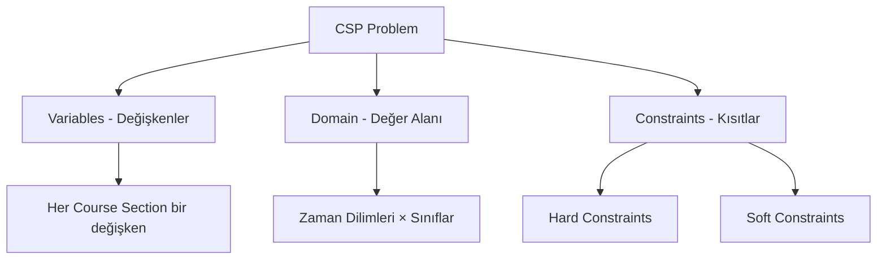
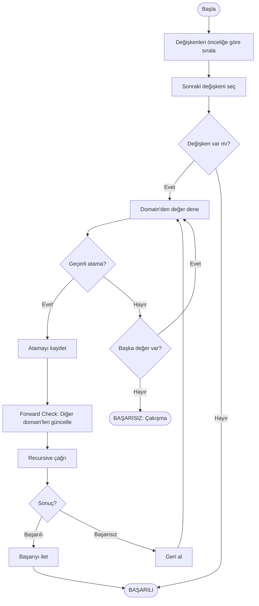

# Scheduling Algorithm Documentation

Akıllı Kampüs Ders Programı Oluşturma Algoritması

---

## 📋 İçindekiler

1. [CSP Problem Tanımı](#csp-problem-tanımı)
2. [Algoritma Açıklaması](#algoritma-açıklaması)
3. [Pseudocode](#pseudocode)
4. [Örnek Çözüm](#örnek-çözüm)
5. [Genetik Algoritma](#genetik-algoritma-alternati̇f)

---

## CSP Problem Tanımı

Ders programı oluşturma, bir **Constraint Satisfaction Problem (CSP)** olarak modellenmiştir.

### Problem Bileşenleri



### Variables (Değişkenler)
Her **CourseSection** bir değişkendir. Hedef, her section'a bir (zaman dilimi, sınıf) çifti atamaktır.

```csharp
public class ScheduleVariable
{
    public CourseSection Section { get; set; }
    public List<TimeSlot> Domain { get; set; }      // Olası zaman dilimleri
    public List<int> SuitableClassrooms { get; set; } // Uygun sınıflar
    public int Priority { get; set; }                // Öncelik değeri
}
```

### Domain (Değer Alanı)
Her değişken için olası atamalar:
- **Günler:** Pazartesi - Cuma (5 gün)
- **Saatler:** 09:00-11:00, 11:00-13:00, 13:00-15:00, 15:00-17:00 (4 slot)
- **Toplam:** 20 zaman dilimi × N sınıf

```csharp
TimeSlots = { 09:00, 11:00, 13:00, 15:00 }  // 2 saatlik bloklar
WeekDays = { 1, 2, 3, 4, 5 }                // Pazartesi-Cuma
```

### Constraints (Kısıtlar)

#### Hard Constraints (Zorunlu)
| Kısıt | Açıklama |
|-------|----------|
| C1 | Bir eğitmen aynı anda iki derste olamaz |
| C2 | Bir sınıf aynı anda iki derse atanamaz |
| C3 | Aynı dersi alan öğrencilerin programları çakışmamalı |
| C4 | Sınıf kapasitesi dersin öğrenci sayısından büyük olmalı |
| C5 | Sınıf özellikleri ders gereksinimlerini karşılamalı |

#### Soft Constraints (Tercihli)
| Kısıt | Açıklama | Puan |
|-------|----------|------|
| S1 | Öğrencilerin ardışık dersleri arasında en az 1 slot boşluk | +10 |
| S2 | Sabah saatleri zorunlu dersler için tercih edilsin | +5 |
| S3 | Aynı bölüm dersleri ardışık olmasın | +3 |
| S4 | Öğle arası (12:00-13:00) mümkünse boş bırakılsın | +2 |

---

## Algoritma Açıklaması

### Backtracking with Forward Checking

Algoritma, **Backtracking** arama stratejisi ile çalışır ve **Forward Checking** optimizasyonu kullanır.



### Adımlar

1. **Ön İşleme**
   - Section'ları önceliğe göre sırala (zorunlu > seçmeli, yüksek kapasite önce)
   - Her section için uygun sınıfları belirle

2. **Backtracking Araması**
   - En yüksek öncelikli section'dan başla
   - Her zaman dilimi + sınıf kombinasyonunu dene
   - Geçerli atama bulunursa devam et
   - Bulunamazsa backtrack yap

3. **Kısıt Kontrolü**
   - Her atama öncesi hard constraints kontrol et
   - Soft constraints puanlama için kullan

4. **Optimizasyon**
   - Domain değerlerini soft constraint puanına göre sırala
   - İyi atamaları önce dene

---

## Pseudocode

### Ana Algoritma

```
FUNCTION GenerateSchedule(sections, classrooms, enrollments):
    // 1. Değişkenleri oluştur ve önceliklendir
    variables = []
    FOR each section in sections:
        variable = {
            section: section,
            domain: GenerateTimeSlots(),
            classrooms: FilterSuitableClassrooms(classrooms, section),
            priority: CalculatePriority(section)
        }
        variables.append(variable)
    
    // 2. Önceliğe göre sırala (yüksek öncelik önce)
    SORT variables by priority DESC
    
    // 3. Backtracking ile çöz
    assignments = []
    conflicts = []
    success = Backtrack(variables, 0, assignments, conflicts, enrollments)
    
    // 4. Sonuçları döndür
    RETURN {
        success: success,
        assignments: assignments,
        conflicts: conflicts
    }
```

### Backtracking Fonksiyonu

```
FUNCTION Backtrack(variables, index, assignments, conflicts, enrollments):
    // Base case: Tüm değişkenler atandı
    IF index >= length(variables):
        RETURN true
    
    variable = variables[index]
    section = variable.section
    
    // Domain değerlerini soft constraint'e göre sırala
    orderedSlots = SortByPreference(variable.domain, section, assignments)
    
    // Her zaman dilimini dene
    FOR each timeSlot in orderedSlots:
        // Her uygun sınıfı dene
        FOR each classroomId in variable.classrooms:
            assignment = {
                sectionId: section.id,
                classroomId: classroomId,
                timeSlot: timeSlot
            }
            
            // Hard constraint kontrolü
            IF IsValidAssignment(assignment, assignments, variables, enrollments):
                // Atamayı ekle
                assignments.append(assignment)
                
                // Recursive çağrı
                IF Backtrack(variables, index + 1, assignments, conflicts, enrollments):
                    RETURN true
                
                // Backtrack: Atamayı geri al
                assignments.remove(assignment)
    
    // Bu değişken için çözüm bulunamadı
    conflicts.append(section.code + ": Uygun zaman bulunamadı")
    RETURN false
```

### Constraint Kontrolü

```
FUNCTION IsValidAssignment(assignment, existingAssignments, variables, enrollments):
    section = FindSection(assignment.sectionId)
    
    // C1: Eğitmen çakışması
    FOR each existing in existingAssignments:
        existingSection = FindSection(existing.sectionId)
        IF existingSection.instructorId == section.instructorId:
            IF existing.timeSlot.day == assignment.timeSlot.day:
                IF TimeOverlaps(existing.timeSlot, assignment.timeSlot):
                    RETURN false
    
    // C2: Sınıf çakışması
    FOR each existing in existingAssignments:
        IF existing.classroomId == assignment.classroomId:
            IF existing.timeSlot.day == assignment.timeSlot.day:
                IF TimeOverlaps(existing.timeSlot, assignment.timeSlot):
                    RETURN false
    
    // C3: Öğrenci çakışması
    sectionStudents = GetStudentsInSection(section.id, enrollments)
    FOR each studentId in sectionStudents:
        otherSections = GetStudentOtherSections(studentId, section.id, enrollments)
        FOR each otherSectionId in otherSections:
            otherAssignment = FindAssignment(otherSectionId, existingAssignments)
            IF otherAssignment != null:
                IF otherAssignment.timeSlot.day == assignment.timeSlot.day:
                    IF TimeOverlaps(otherAssignment.timeSlot, assignment.timeSlot):
                        RETURN false
    
    RETURN true
```

### Öncelik Hesaplama

```
FUNCTION CalculatePriority(section):
    priority = 0
    
    // Kapasiteye göre (büyük dersler önce)
    priority += section.capacity * 10
    
    // Ders tipine göre
    IF section.course.type == "Required":
        priority += 1000
    ELSE IF section.course.type == "Elective":
        priority += 500
    
    // Kayıtlı öğrenci sayısına göre
    priority += section.enrolledCount * 5
    
    RETURN priority
```

---

## Örnek Çözüm

### Giriş Verileri

```json
{
  "sections": [
    { "id": 1, "code": "CENG101", "instructor": "Dr. Ahmet", "capacity": 60 },
    { "id": 2, "code": "MATH101", "instructor": "Dr. Ayşe", "capacity": 80 },
    { "id": 3, "code": "PHYS101", "instructor": "Dr. Mehmet", "capacity": 70 },
    { "id": 4, "code": "CENG102", "instructor": "Dr. Ahmet", "capacity": 50 }
  ],
  "classrooms": [
    { "id": 1, "name": "A101", "capacity": 100 },
    { "id": 2, "name": "B202", "capacity": 60 },
    { "id": 3, "name": "C303", "capacity": 80 }
  ]
}
```

### Algoritma Adımları

| Adım | Section | Denenen | Sonuç |
|------|---------|---------|-------|
| 1 | MATH101 (öncelik: 1800) | Pzt 09:00, A101 | ✅ Atandı |
| 2 | PHYS101 (öncelik: 1700) | Pzt 09:00, A101 | ❌ Sınıf çakışması |
| 2 | PHYS101 | Pzt 09:00, C303 | ✅ Atandı |
| 3 | CENG101 (öncelik: 1600) | Pzt 11:00, B202 | ✅ Atandı |
| 4 | CENG102 (öncelik: 1500) | Pzt 11:00, B202 | ❌ Sınıf çakışması |
| 4 | CENG102 | Pzt 09:00, B202 | ❌ Eğitmen çakışması (Dr. Ahmet CENG101'de) |
| 4 | CENG102 | Salı 09:00, B202 | ✅ Atandı |

### Çıktı

```json
{
  "success": true,
  "scheduledCount": 4,
  "schedules": [
    { "section": "MATH101", "day": "Pazartesi", "time": "09:00-11:00", "classroom": "A101" },
    { "section": "PHYS101", "day": "Pazartesi", "time": "09:00-11:00", "classroom": "C303" },
    { "section": "CENG101", "day": "Pazartesi", "time": "11:00-13:00", "classroom": "B202" },
    { "section": "CENG102", "day": "Salı", "time": "09:00-11:00", "classroom": "B202" }
  ]
}
```

### Görsel Program

| Saat | Pazartesi | Salı | Çarşamba | Perşembe | Cuma |
|------|-----------|------|----------|----------|------|
| 09:00-11:00 | MATH101 (A101), PHYS101 (C303) | CENG102 (B202) | - | - | - |
| 11:00-13:00 | CENG101 (B202) | - | - | - | - |
| 13:00-15:00 | - | - | - | - | - |
| 15:00-17:00 | - | - | - | - | - |

---

## Genetik Algoritma (Alternatif)

Daha büyük problem setleri için **Genetik Algoritma** alternatifi de mevcuttur.

### Avantajları
- Soft constraints'i daha iyi optimize eder
- Büyük problem setlerinde daha hızlı
- Yaklaşık optimal çözüm bulur

### Parametreler

```json
{
  "populationSize": 50,
  "generations": 100,
  "mutationRate": 0.1,
  "crossoverRate": 0.8,
  "elitismCount": 5
}
```

### Fitness Fonksiyonu

```
FUNCTION CalculateFitness(chromosome):
    fitness = 1000  // Başlangıç puanı
    
    // Hard constraint ihlalleri için büyük ceza
    fitness -= CountInstructorConflicts(chromosome) * 100
    fitness -= CountClassroomConflicts(chromosome) * 100
    fitness -= CountStudentConflicts(chromosome) * 50
    
    // Soft constraints için bonus/ceza
    fitness += CountGoodTimeSlots(chromosome) * 5
    fitness += CountSpaceBetweenClasses(chromosome) * 3
    
    RETURN max(0, fitness)
```

### Endpoint Kullanımı

```bash
POST /api/v1/scheduling/generate/genetic
Content-Type: application/json

{
  "semester": "fall",
  "year": 2024,
  "sectionIds": [1, 2, 3, 4],
  "populationSize": 50,
  "generations": 100
}
```

---

## Karmaşıklık Analizi

| Metrik | CSP Backtracking | Genetik Algoritma |
|--------|------------------|-------------------|
| Zaman | O(d^n) worst case | O(g × p × n) |
| Bellek | O(n) | O(p × n) |
| Optimal | Evet (tam çözüm) | Hayır (yaklaşık) |
| Büyük veri | Yavaşlayabilir | Sabit performans |

**Notasyon:**
- n: Section sayısı
- d: Domain boyutu (20)
- g: Nesil sayısı
- p: Popülasyon boyutu
